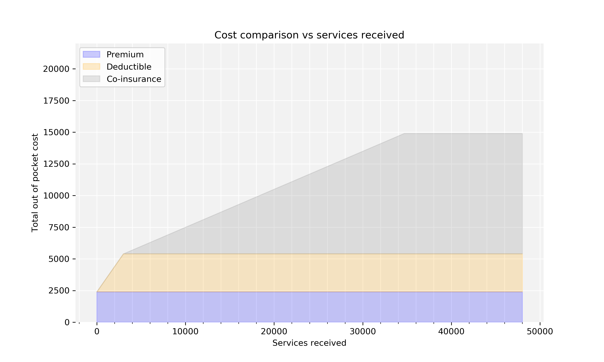
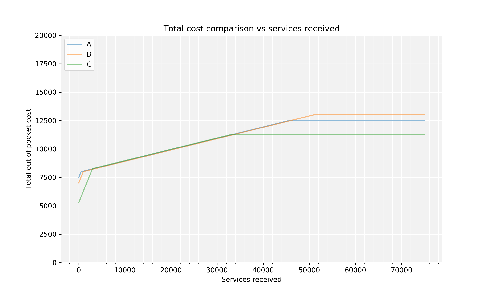

Insurance
=============================

A tool for comparing health insurance plans 

## Getting started

1. Make sure the information about the health insurance plans you would like to compare in *rates.json* is correct. 
2. Make sure the required Python packages are installed. Currently these are:
    * *json*
    * *numpy*
    * *matplotlib*
3. Run the Python script *analysis.py*.

## Overview

Running *analysis.py* produces a plot like the following for each plan described in *rates.json*, called *\<plan_name\>.png*:

This plot shows the total out of pocket cost for every level of services received under the corresponding plan, and how much of this cost is spent on the plan's premiums, deductible, and co-insurance.
For example, if I received $10,000 worth of medical care in a year under this plan, my total out of pocket cost would be $7,500, with $2,400 going toward premiums, $3,000 toward the deductible, and the rest toward co-insurance.

A plot like the following called *totals.png* is also produced, which compares the total out of pocket cost for every level of services received under each plan:

This plot allows us to easily see which plan will result in the lowest out-of-pocket cost for each level of services received.
